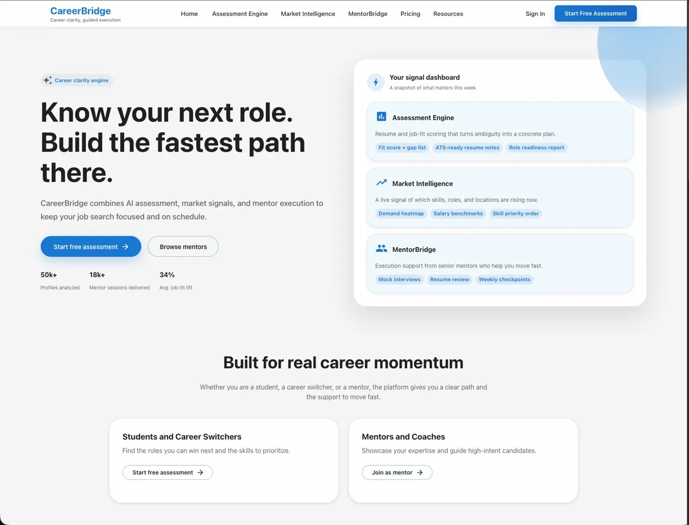
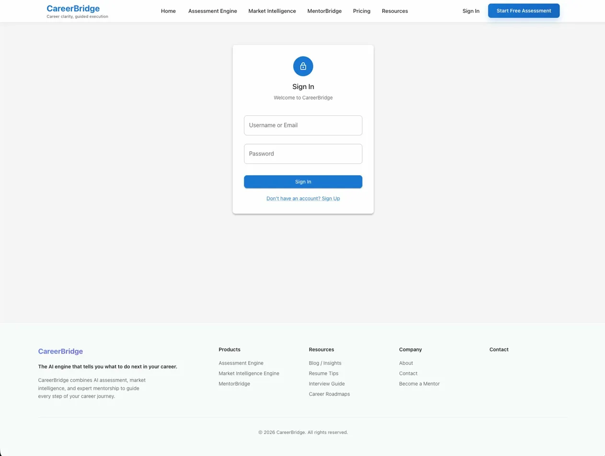
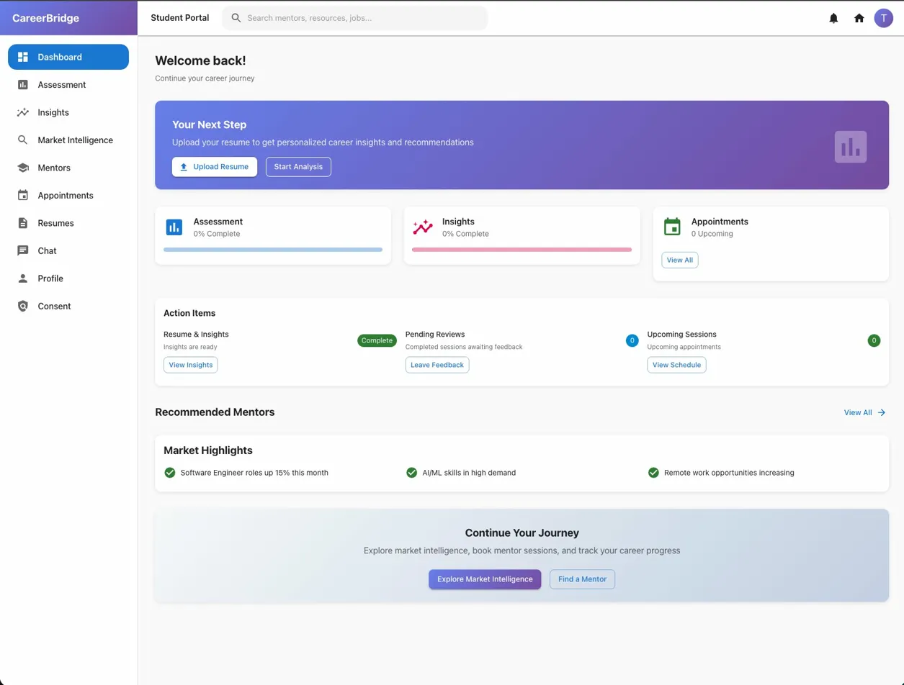
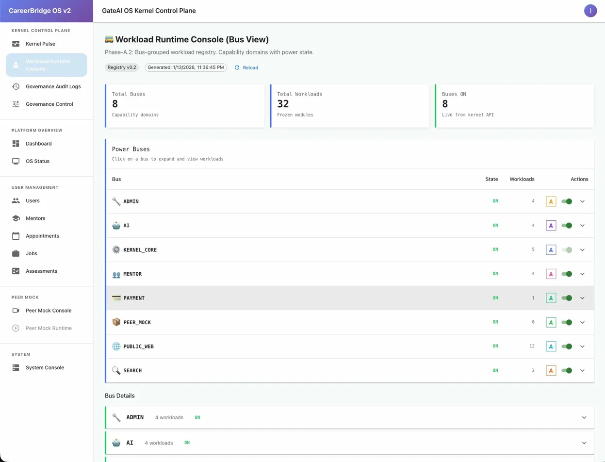
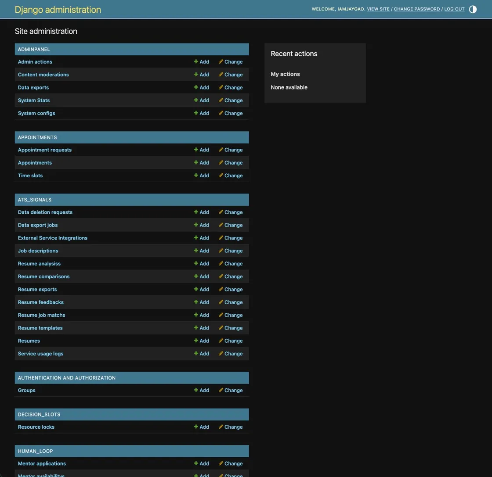

# CareerBridge

A production-style full-stack platform built with Django REST, React, PostgreSQL, Redis, Celery, Docker, Stripe, and OpenAI, supporting mentor booking, resume analysis, payments, real-time chat, and governance-controlled feature rollout.

   

---

## Engineering Highlights

- Built a full-stack career platform with 13 backend service domains, covering authentication, mentor booking, payments, chat, resume analysis, peer mock interviews, and admin workflows.
- Containerized the system as an 8-service Docker deployment with Django, React, PostgreSQL, Redis, Nginx, Celery, Prometheus, and Grafana.
- Implemented async task processing with Celery + Redis for notifications, AI analysis, scheduled jobs, and background workflows.
- Integrated Stripe payment flows with strict appointment binding to prevent orphaned payment intents and preserve transaction consistency.
- Added governance middleware and role-based access control across student, mentor, staff, admin, and superadmin workflows.

---

## Tech Stack

| Layer | Technology |
|-------|-----------|
| Frontend | React 18, TypeScript, Material UI, Redux Toolkit |
| Backend | Django 5.2, Django REST Framework, Celery |
| Database | PostgreSQL 15, Redis 7 |
| Auth | JWT (SimpleJWT) |
| Payments | Stripe |
| AI | OpenAI GPT |
| Infrastructure | Docker, Nginx, AWS S3 |

---

## Architecture

```
React SPA (TypeScript)
       ↓ HTTP / WebSocket
     Nginx (reverse proxy)
       ↓
Django REST API (gateai/)     ←→   PostgreSQL
       ↓                      ←→   Redis (cache + Celery broker)
  Celery Workers
       ↓
External APIs: OpenAI · Stripe · JobCrawler · ResumeMatcher
```

**User Roles:** `student` · `mentor` · `staff` · `admin` · `superadmin`

---

## Screenshots

| Landing Page | Sign In |
|---|---|
|  |  |

| Student Dashboard | Governance Console |
|---|---|
|  |  |

| Django Admin |
|---|
|  |

---

## Features

- **Mentor Discovery & Booking** — Browse mentor profiles by expertise, book time slots, and manage appointments
- **AI Resume Analysis** — ATS compatibility scoring and keyword optimization via OpenAI
- **Peer Mock Interviews** — Practice sessions with real-time feedback
- **Real-time Chat** — WebSocket-based messaging between students and mentors
- **Payments** — Stripe checkout for paid mentor sessions
- **Admin Dashboard** — Staff and superadmin management with role-based access control
- **Governance Engine** — Feature flag system with bus-powered capability management

---

## Architecture Decisions

- **Domain-separated Django backend** — Organized the backend into clear modules for users, appointments, payments, chat, resume analysis, peer mock interviews, and governance.
- **Async-first background processing** — Used Celery + Redis for notifications, AI analysis, scheduled jobs, and long-running workflows.
- **Payment consistency by design** — Bound every Stripe payment intent to an appointment context to prevent orphaned transactions.
- **Governance-controlled rollout** — Added feature flags and role-based capability control for safer admin and superadmin operations.
- **Production-oriented deployment** — Containerized the platform with Docker, Nginx, PostgreSQL, Redis, Celery, Prometheus, and Grafana.

---

## Getting Started

### Prerequisites

- Docker Desktop
- Git

### Run Locally

```bash
# 1. Clone the repository
git clone https://github.com/iamjaygao/CareerBridge.git
cd CareerBridge

# 2. Create environment file
cp env.production.template .env
# Fill in required values (see Configuration below)

# 3. Build and start all services
docker compose -f docker-compose.prod.yml up --build

# 4. Open in browser
open http://localhost
```

### Create a superuser (optional)

```bash
docker compose -f docker-compose.prod.yml exec careerbridge python manage.py createsuperuser
```

Then access the admin panel at `http://localhost/admin/`.

---

## Configuration

Copy `env.production.template` to `.env` and fill in:

| Variable | Required | Description |
|----------|----------|-------------|
| `POSTGRES_PASSWORD` | ✅ | PostgreSQL password |
| `SECRET_KEY` | ✅ | Django secret key (50+ chars) |
| `OPENAI_API_KEY` | ✅ | For AI resume analysis |
| `STRIPE_SECRET_KEY` | ✅ | For payment processing |
| `STRIPE_PUBLISHABLE_KEY` | ✅ | For frontend Stripe.js |
| `AWS_ACCESS_KEY_ID` | Optional | For S3 file storage |
| `USE_S3` | Optional | Set `True` to enable S3 |

---

## Project Structure

```
CareerBridge/
├── gateai/               # Django backend
│   ├── users/            # Auth, registration, profiles
│   ├── human_loop/       # Mentor profiles & availability
│   ├── appointments/     # Booking system
│   ├── payments/         # Stripe integration
│   ├── chat/             # Real-time messaging
│   ├── ats_signals/      # Resume analysis engine
│   ├── peer_mock/        # Mock interview system
│   ├── kernel/           # Governance & feature flags
│   └── gateai/           # Django settings & URLs
├── frontend/             # React + TypeScript SPA
├── nginx/                # Reverse proxy config
├── monitoring/           # Prometheus + Grafana
└── docker-compose.prod.yml
```

---

## API Documentation

With `DEBUG=True`, Swagger UI is available at:

```
http://localhost/swagger/
http://localhost/redoc/
```

---

## License

MIT